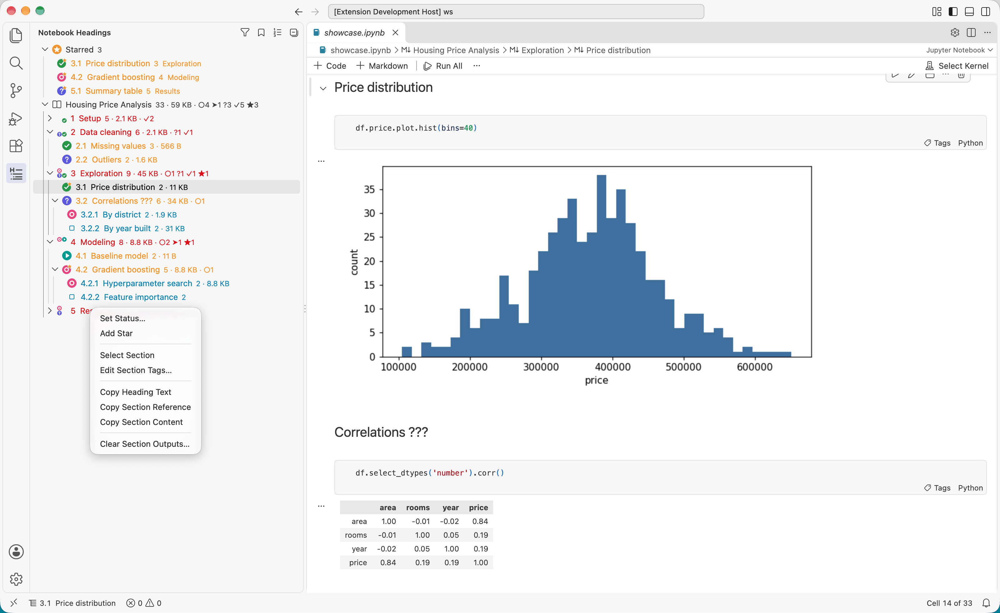
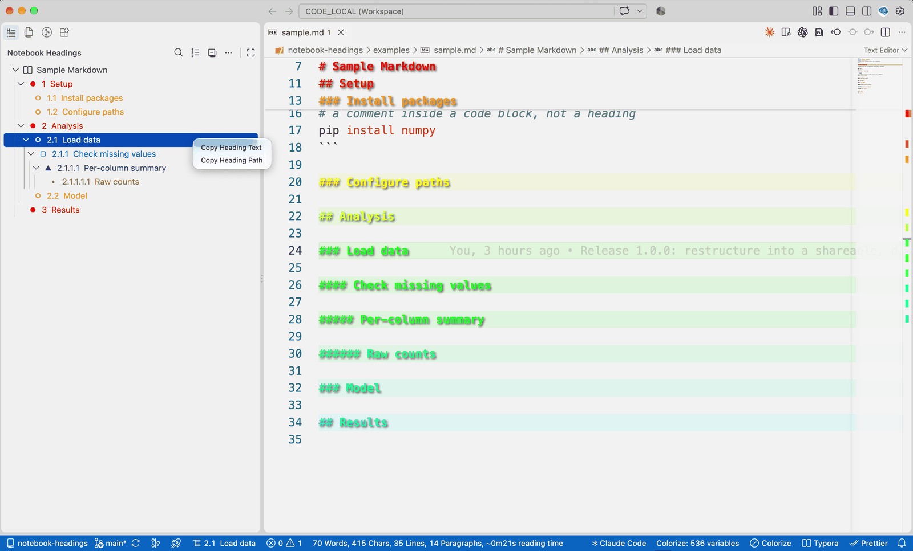

# Notebook Headings 使用说明

[English](README.md)

一个 VS Code 扩展：为 **Jupyter notebook（.ipynb）** 和 **Markdown（.md）** 文件提供分级标题目录，专门为有成百上千个标题的大文件设计。

VS Code 自带的 Outline 会把所有标题全部展开，标题一多就没法看。这个扩展保留全部六级标题，但打开时只展开到你设定的层级（默认到 `##`），先看整体结构，需要时再逐级展开。



## 快速上手

- **安装**：在 VS Code 扩展面板搜索 "Notebook Headings"，或打开[插件市场页面](https://marketplace.visualstudio.com/items?itemName=cuihuaxia.notebook-headings)安装（见[安装](#安装)）。
- **分享给别人**：把插件市场链接发给对方即可（见[分享给别人](#分享给别人)）。
- **从源码构建或参与开发**：见 [CONTRIBUTING.md](CONTRIBUTING.md)（英文）。

## 功能一览

- **默认只展开到指定层级**：所有标题都在，只是更深的层级先折叠。随时点"折叠到默认层级"按钮恢复。
- **自动编号**：`1`、`1.2`、`1.2.3`。只有一个 `#` 标题时把它当作页面标题，不编号，从 `##` 开始编 1、2、3。工具栏一键开关。
- **按层级区分颜色和形状**：`##` 红 ●、`###` 橙 ○、`####` 蓝 ■、`#####` 紫 ▲、`######` 橄榄 •，浅色/深色主题各有一套配色，颜色可自定义。
- **小节 cell 数和输出大小**：notebook 中每个标题右侧的灰色文字显示该小节包含的 cell 数和输出总大小，例如 `34 · 2.1 MB`，方便找出让 notebook 变大或渲染变慢的小节。
- **跟随当前位置**：在文档里点击或滚动时，目录自动高亮当前小节；不会自动展开你折叠起来的部分。
- **状态栏显示当前小节**：悬停显示完整路径，点击打开目录。
- **搜索过滤**（目录面板中 `Cmd+Alt+F`）：边输入边过滤，匹配文字高亮，保留上级标题。
- **快速跳转**（在 notebook 或 Markdown 编辑器中 `Cmd+Alt+O`）：弹出所有标题的搜索列表。
- **选中整节**（右键 → **Select Section**）：选中这一节的所有 cell（Markdown 中是所有行），包括下级小节，之后可以用 VS Code 自带的命令剪切、复制、移动、运行或删除整节。先用 `Cmd`/`Ctrl` + 点击或 `Shift` + 点击选中多个标题，就能一次选中多个小节。
- **右键复制**：复制标题文字、**本节引用**（文件、带编号的完整路径和 cell 范围，如 `code/Analysis.ipynb · 2  Analysis › 2.1  Summary · 第 12–30 个 cell`；方便发给 Claude Code 等 AI 助手，它们读得到选中的文字，读不到选中的 cell），或者把**本节内容**复制成纯文本。
- **中英文界面**：命令、菜单、设置和提示信息跟随 VS Code 的显示语言。
- **一键设置 cell 标签**：每个代码 cell 右下角有一个 **Tags** 按钮，点击后弹出简短的勾选列表，列出在 Jupyter Book / MyST 网页上把 cell 部分内容折叠起来（可点开）的标签：`hide-output`、`hide-input`、`hide-cell`。其他标签可以直接输入。标签保存在 Jupyter、Jupyter Book 和 nbconvert 读取的位置。
- **状态标记**：右键标题 → **Set Status…**（设置状态），可标为待做、进行中、待核对或已完成，标题前的层级图标会换成彩色实心的状态图标。标题里带 `???` 的自动算作"进行中"。
- **星标**：**Add Star**（加星标）在标题前显示金色星标图标，并把标题列到目录顶部的"星标"分组里，点一下就能跳过去。
- **折叠起来也看得到标记**：每个上级标题的右侧会汇总它下面各级（直到第六级）的标记，例如 `○2 ➤1 ✓3 ★2`（○ 待做、➤ 进行中、? 待核对、✓ 已完成、★ 星标）；第一级标题前面还会用小图标显示这一节里有哪些状态。工具栏的书签按钮只显示有标记的标题。标记保存在 notebook 文件里，跟着文件走。
- **安全**：从不改动你的代码、文字或输出。扩展只会修改你亲自设置的 cell 元数据——cell 的标签和标题的标记，都可以用 `Cmd+Z` 撤销。

Markdown 解析会跳过文件开头的 YAML front matter 和代码块，代码里的 `# 注释` 不会被当成标题。



## 安装

### 方法一：从插件市场安装（推荐）

VS Code 扩展面板 → 搜索 **Notebook Headings** → **Install**，或者在终端运行：

```bash
code --install-extension cuihuaxia.notebook-headings
```

如果提示找不到 `code` 命令：在 VS Code 命令面板（`Cmd+Shift+P`）运行 **Shell Command: Install 'code' command in PATH**；或者直接用完整路径 `"/Applications/Visual Studio Code.app/Contents/Resources/app/bin/code"`。

装好后运行 **Developer: Reload Window（重新加载窗口）**，左侧活动栏会出现一个新图标（"H" 加几条列表线）。

要求 VS Code 1.80 或更新版本。适用于 Jupyter 扩展打开的任何 notebook，与内核无关（Python、R 等都可以）。

### 方法二：安装打包好的文件

每个版本的安装包都附在对应的 [GitHub Release](https://github.com/CuihuaXia/notebook-headings/releases) 上，也保存在 [`releases/`](releases/) 文件夹里。扩展面板右上角 `…` 菜单 → **Install from VSIX…（从 VSIX 安装）** → 选择 `.vsix` 文件；或者：

```bash
code --install-extension releases/notebook-headings-<version>.vsix
```

只在无法访问插件市场时使用：从 VSIX 安装的扩展不会被 Settings Sync 同步，也不会自动更新。

如需从源码构建，见 [CONTRIBUTING.md](CONTRIBUTING.md)（英文）。

## 换新设备时

- 开启了 **Settings Sync** 的话，从插件市场安装的扩展会自动装到所有同步的设备上，并自动更新。
- 没开的话，在每台设备上从插件市场安装一次即可。
- 你改过的颜色、快捷键等设置保存在 VS Code 的 `settings.json` / `keybindings.json` 里，不在本仓库中，也由 Settings Sync 同步。

## 分享给别人

把[插件市场链接](https://marketplace.visualstudio.com/items?itemName=cuihuaxia.notebook-headings)发给对方，或者让对方在扩展面板搜索 "Notebook Headings"。问题和建议可以提到 [GitHub Issues](https://github.com/CuihuaXia/notebook-headings/issues)。

## 使用

1. 打开一个 `.ipynb` 或 `.md` 文件。
2. 点击左侧活动栏的 Notebook Headings 图标。
3. 点击任意标题跳转过去。

目录面板标题栏的按钮（从左到右）：

| 按钮 | 作用 |
| --- | --- |
| Filter Headings（漏斗） | 输入关键词过滤；Enter 保留，Esc 取消。过滤时变成 ✕，点击清除。 |
| Show Marked Headings（书签） | 只看有标记的标题：加了星标的，以及待做、进行中、待核对的（连同上级标题）。点 ✕ 返回。 |
| 1≡ Toggle Heading Numbers | 显示/隐藏编号。 |
| ⊟ Collapse to Default Level | 恢复默认展开层级。 |

在标题上**右键**：

- **Set Status…**（设置状态，仅 notebook）：待做、进行中、待核对、已完成，或清除状态。标题文字里带 `???` 的算作"进行中"，直到你设置了别的状态或删掉 `???`。
- **Add Star / Remove Star**（加星标 / 取消星标，仅 notebook）：加了星标的标题列在目录顶部的"星标"分组里，点一下就跳过去。
- **Select Section**（选中本节）：选中这一节的所有 cell（notebook）或所有行（Markdown），包括下级小节，并把焦点切到编辑器。之后用 `Cmd+X` / `Cmd+V` 移动整节，`Cmd+C` 复制，或者运行、删除选中的 cell。如果这个标题和前面的标题共用第一个 cell，这个 cell 也会被选中，状态栏会提示。
- **Edit Section Tags…**（编辑本节标签，仅 notebook）：为这一节（包括所有子小节）的所有代码 cell 打开标签勾选列表，比如一次给整个分析小节加上 `hide-output`。标题和文字 cell 不受影响，网页上这一节仍然可读。
- **Copy Heading Text**（复制标题文字）。
- **Copy Section Reference**（复制本节引用）：复制文件路径、标题路径和 cell 范围（Markdown 中是行号范围），例如 `code/Analysis.ipynb · 2  Analysis › 2.1  Summary · 第 12–30 个 cell`。粘贴到 Claude Code 等 AI 对话里，就能指明是哪一节；这些工具读得到选中的文字，但读不到选中的 cell。
- **Copy Section Content**（复制本节内容）：把这一节所有 cell（或所有行）复制成纯文本，代码 cell 用带语言的 ```` ``` ```` 代码块包起来。

用 `Cmd`/`Ctrl` + 点击或 `Shift` + 点击选中多个标题，再在其中一个上右键：设置状态和星标会作用于所有选中的标题；**Select Section** 会一次选中这些小节的所有 cell（嵌套或相邻的小节会自动合并，不会重复选中）；**Edit Section Tags…** 会给这些小节的所有代码 cell 设置标签；复制命令按文档顺序每个标题复制一行（复制本节内容则合成一段文字）。

给 cell 设置标签：点击 cell 右下角的 **Tags**（已有标签时显示数量），勾选或取消标签，或者输入新标签，然后按 Enter。输入的文字会先用来筛选列表（比如输入 `hide` 会筛出 `hide-input`、`hide-output` 等）；只有匹配不到任何已有标签时，才会作为新标签添加。命令面板里的 **Notebook Headings：编辑 cell 标签…** 对当前选中的 cell 做同样的事。Markdown cell 只有已经有标签时才显示这个按钮。

一次给多个 cell 设置标签：先选中这些 cell（比如用 **Select Section** 选中整节），再点击其中任意一个 cell 的 **Tags**，或者用命令面板；只给其中的代码 cell 设置标签（跳过 Markdown cell）。所有选中的 cell 都有的标签默认勾上，取消勾选就从所有 cell 上去掉；只有部分 cell 有的标签会标注"（3/10 个 cell）"，保持不勾就不改动，勾上则加到所有 cell 上。整次修改用一次 `Cmd+Z` 就能撤销。

快捷键（可在"键盘快捷方式"里搜索 "Notebook Headings" 修改）：

| 快捷键（macOS / Windows、Linux） | 生效位置 | 功能 |
| --- | --- | --- |
| `Cmd+Alt+O` / `Ctrl+Alt+O` | notebook 或 Markdown 编辑器 | 快速跳转到标题 |
| `Cmd+Alt+F` / `Ctrl+Alt+F` | Notebook Headings 面板 | 搜索过滤 |

## 设置项

在 VS Code 设置中搜索 "Notebook Headings"，或在 `settings.json` 中修改：

| 设置 | 默认值 | 说明 |
| --- | --- | --- |
| `notebookHeadings.defaultExpandLevel` | `2` | 打开文件时默认展开到第几级（1–6） |
| `notebookHeadings.numbering` | `true` | 显示编号 |
| `notebookHeadings.numberH1` | `false` | 一级标题 `#` 也参与编号 |
| `notebookHeadings.levelColors` | `true` | 按层级上色并显示形状图标 |
| `notebookHeadings.showCellCount` | `true` | 显示 notebook 每个小节的 cell 数 |
| `notebookHeadings.showOutputSize` | `true` | 显示 notebook 每个小节的输出总大小 |
| `notebookHeadings.followCursor` | `true` | 目录高亮当前所在小节 |
| `notebookHeadings.statusBar` | `true` | 状态栏显示当前小节 |
| `notebookHeadings.cellTagButton` | `true` | 在代码 cell 上显示 Tags 按钮 |
| `notebookHeadings.markdown` | `true` | 同时支持 Markdown 文件 |
| `notebookHeadings.inProgressMarkers` | `["???", "？？？"]` | 标题里含有这些文字就显示为"进行中"；设为 `[]` 关闭 |

### 状态标记和星标

| 图标 | 状态 | 汇总里的符号 |
| --- | --- | --- |
| 粉色圆 + 白色圆圈 | 待做 | `○` |
| 青绿色圆 + 白色播放箭头 | 进行中（标题里带 `???` 的也算） | `➤` |
| 靛蓝色圆 + 白色问号 | 待核对 | `?` |
| 绿色圆 + 白色对勾 | 已完成 | `✓` |
| 金色圆 + 白色五角星 | 星标（已有状态图标的，在右上角加一颗小星星） | `★` |

第一级标题如果下面有状态，前面会改成田字格，用缩小的图标显示这一节里有哪些状态：左上待做、右上进行中、左下待核对、右下已完成。**Show Marked Headings**（书签按钮）显示加了星标的标题和未完成的状态（待做、进行中、待核对），不显示已完成的。

### 标记保存在哪里

状态和星标保存在标题所在 cell 的 Jupyter 元数据里，例如 `"notebook_headings": {"0": {"status": "todo", "star": true}}`（`"0"` 表示这个 cell 里的第一个标题）。改标题文字、移动 cell、把文件拷到别的电脑，标记都还在；Jupyter、Jupyter Book 和 nbconvert 会忽略它。和其他修改一样，要保存 notebook 才会写进文件。标记只适用于 notebook；Markdown 文件里 `???` 仍然有效。标记记在"这个 cell 里的第几个标题"上，所以如果在同一个 cell 里已有标题的上方再加一个标题，这个 cell 里的标记会往后错一位。

### 自定义颜色

在 `settings.json` 中覆盖。`level1` 是除标题外最浅的一级（通常是 `##`）：

```json
"workbench.colorCustomizations": {
  "notebookHeadings.level1Foreground": "#DC1D04",
  "notebookHeadings.level2Foreground": "#F29F05",
  "notebookHeadings.level3Foreground": "#048ABF",
  "notebookHeadings.level4Foreground": "#5B2A9E",
  "notebookHeadings.level5Foreground": "#A69232",
  "notebookHeadings.level6Foreground": "#B3B3B3"
}
```

只想对某个主题生效时，套在主题名下面，例如
`"[Default Dark Modern]": { "notebookHeadings.level1Foreground": "#FF6B4A" }`。

## 层级是怎么算的

- 文档中只有一个 `#` 标题时，它被当作页面标题：默认颜色、书本图标、不编号。
- 其余标题按"相对层级"计算：以除标题外最浅的一级为第 1 级。一般 notebook 中 `##` 是第 1 级（红），`###` 是第 2 级，依此类推。
- 允许跳级：`##` 下面直接写 `####`，它就作为 `##` 的子标题。
- notebook 中小节的 cell 数：从该标题所在 cell 开始，到下一个同级或更高级标题为止。

## 已知限制

- VS Code 不允许扩展修改目录面板的字号和字重，所以层级只能用颜色、图标形状和缩进区分。
- 只识别 `#` 开头的标题，不识别下划线式标题（`===` / `---`）和 HTML `<h2>` 标签。
- 标题上色借用了 VS Code 给文件名上色的机制，因此每个标题前都有一个图标位。
- 标题右侧的灰色文字只能是纯文本，所以标记汇总用的是符号（`○ ➤ ? ✓ ★`），不能显示彩色图标。

## 参与开发

欢迎提交问题和 Pull Request。从源码构建、调试方法和项目结构见 [CONTRIBUTING.md](CONTRIBUTING.md)（英文）。

## 许可证

[MIT](LICENSE) © 2026 Cuihua Xia
